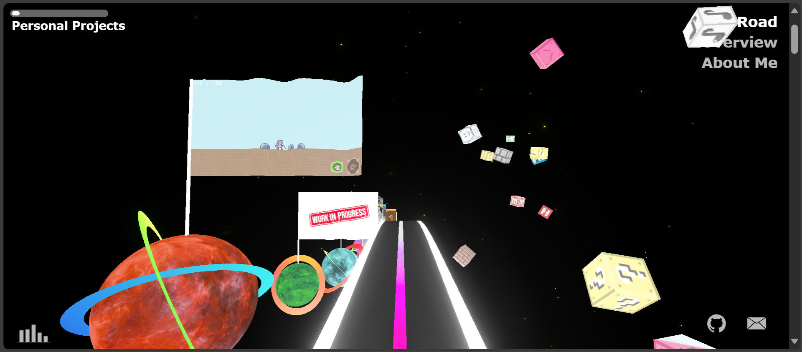

# PyroWilDx-3d

[**PyroWilDx-3d**](https://github.com/PyroWilDx/PyroWilDx-3d/) is my former 3d portfolio website, where I created a galaxy in which each planet represents a project I developed.

Although I no longer update it, you can still explore [PyroWilDx-3d](https://pyrowildx.github.io/PyroWilDx-3d/).



## Development Set-Up

<div align="center">

[](https://www.typescriptlang.org/)
&nbsp;&nbsp;&nbsp;&nbsp;
[](https://code.visualstudio.com/)
&nbsp;&nbsp;&nbsp;&nbsp;
[](https://www.microsoft.com/windows/)

[ThreeJs](https://threejs.org/) \
[NodeJs](https://nodejs.org/)

</div>

### How To Use

- Install npm dependencies.

```
npm install
```

- Start development server.

```
npm run dev
```

---

<div align="center">
  Copyright &#169; 2023 PyroWilDx. All Rights Reserved.
</div>
